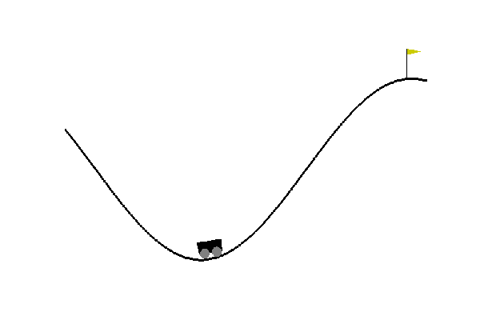

# What is Reinforcement-Learning?

Reinforcement learning is a category of machine learning and it is best understood as If we have an **agent** that interacts with an **environment** such that it can observe the environment **state** and perform **actions**. Upon doing actions, the environment state changes into a new state and the agent recieves a **reward** (or penalty). Reinforcement learning aims at making this agent learn from his experience of interactions with environment so that it chooses the best actions that maximizes the sum of rewards it receives from the environment.
Reinforcement Learning is one of the major parts of **Machine-Learning** alongside **Supervised** and **Unsupervised Learning**.

## Markov Decision Process

Firstly let us talk about the **Markov Property**.
The Markov Property states that `"Once the future is known then the past is irrelevant"`, in mathematical words
a state **_S_**_t_ has the  _Markov_ property, if and only if;

**_P_**[**S**_t+1_ **_|_** **S**_t_] _=_ **_P_**[**S**_t+1_ **_|_** **S**_1_, ….. , **_S_**_t_].

For a _Markov_ state **S** and successor state **S′**, the state transition probability function is defined by,

**MDP** is basically used to describe the agent and environment interaction in a formal way.
**MDP** consists of a tuple of 5 elements:

-   `S` : Set of states. At each time step the state of the environment is an element `s ∈ S`.
-   `A`: Set of actions. At each time step the agent choses an action `a ∈ A` to perform.
-   `p(s_{t+1} | s_t, a_t)` : State transition model that describes how the environment state changes when the user performs an action `a` depending on the action `a`and the current state **s**.
-   `p(r_{t+1} | s_t, a_t)` : Reward model that describes the real-valued reward value that the agent receives from the environment after performing an action. In MDP the the reward value depends on the current state and the action performed.
-   **𝛾** : discount factor that controls the importance of future rewards. We will describe it in more details later.

The way by which the agent chooses which action to perform is named the agent `policy` which is a function that takes the current environment state to return an action. The policy is often denoted by the symbol 𝛑.

Let’s now differentiate between two types environments.

**Deterministic environment**: deterministic environment means that both state transition model and reward model are deterministic functions. If the agent while in a given state repeats a given action, it will always go the same next state and receive the same reward value.

**Stochastic environment**: In a stochastic environment there is uncertainty about the actions effect. When the agent repeats doing the same action in a given state, the new state and received reward may not be the same each time. For example, a robot which tries to move forward but because of the imperfection in the robot operation or other factors in the environment (e.g. slippery floor), sometimes the action `forward` will make it move forward but in sometimes, it will move to `left` or `right.`

Deterministic environments are easier to solve, because the agent knows how to plan its actions with no-uncertainty given the environment MDP. Possibly, the environment can be modeled in as a graph where each state is a node and edges represent transition actions from one state to another and edge weights are received rewards. Then, the agent can use a graph search algorithm such as A* to find the path with maximum total reward form the initial state.
## Value function

Many reinforcement learning introduce the notion of `**value-function**` which often denoted as `V(s)` . The value function represent how good is a state for an agent to be in. It is equal to expected total reward for an agent starting from state `s`. The value function depends on the policy by which the agent picks actions to perform.

## Value Iteration

Value iteration computes the optimal state value function by iteratively improving the estimate of **V(s)**. The algorithm initialize **V(s)** to arbitrary random values. It repeatedly updates the **Q(s, a)** and **V(s)** values until they converges. Value iteration is guaranteed to converge to the optimal values. This algorithm is shown in the following pseudo-code:

## Policy Iteration 

While value-iteration algorithm keeps improving the value function at each iteration until the value-function converges. Since the agent only cares about the finding the optimal policy, sometimes the optimal policy will converge before the value function. Therefore, another algorithm called policy-iteration instead of repeated improving the value-function estimate, it will re-define the policy at each step and compute the value according to this new policy until the policy converges. Policy iteration is also guaranteed to converge to the optimal policy and it often takes less iterations to converge than the value-iteration algorithm.

The pseudo code for Policy Iteration is shown below.
 `Used Value-Iteration and Policy-Iteration to train a environment(Frozen-Lake8x8) available on gym`

## Q-Learning
**Q-Learning** is an example of model-free learning algorithm. It does not assume that agent knows anything about the state-transition and reward models. However, the agent will discover what are the good and bad actions by trial and error.

The basic idea of Q-Learning is to approximate the state-action pairs Q-function from the samples of Q(s, a) that we observe during interaction with the enviornment. This approach is known as **Time-Difference Learning.**

where 𝛂 is the learning rate. The `Q(s,a)`table is initialized randomly. Then the agent starts to interact with the environment, and upon each interaction the agent will observe the reward of its action `r(s,a)`and the state transition (new state `s'`). The agent compute the observed Q-value Q_obs(s, a) and then use the above equation to update its own estimate of `Q(s,a)` .
` Used the Q-learning algorithm to train the mountain-car environment on OpenAI Gym.`

## Mountain-Car v0:

Trained the mountain-car environment on openai gym using q-learning.

## Background

OpenAI offers a toolkit for practicing and implementing Deep Q-Learning algorithms. ([http://gym.openai.com/](http://gym.openai.com/)) This is my implementation of the MountainCar-v0 environment. This environment has a small cart stuck in a trench. The cart needs to get to the flag on top of the crest to gain points and the faster it learns to do this, it gains more points. The cart can go left and right, with any variation of speed. Once the cart performs an action, the environment provides it a reward and tells it where the cart is at this point.

` Similarly used Value-Iteration and Policy-Iteration to train and test the frozen-lake environment on openai gym`

## Conclusion:
This was my first project on Reinforcement Learning. I am very thankful to my mentor- "Pawan Agarwal" who helped me throughout the course of my project and cleared my doubts.
The MountainCar showed me how a complex learning algorithm in a continuous space could be developed through Deep Q Learning instead of arduous man hours by developers.
## References:
-   [Stanford CS234 Reinforcement Learning](http://web.stanford.edu/class/cs234/index.html?source=post_page---------------------------)
-   [UC Berkley CS188 Introduction to AI](http://ai.berkeley.edu/course_schedule.html?source=post_page---------------------------)
